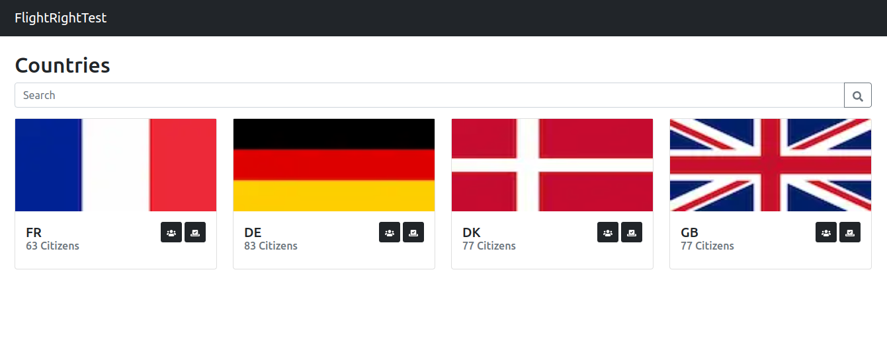

# Nationalities & Citizens

This project built using Next.js framework.



## Online Demo

You can access an online deployment for this project from the following URL:

https://flight-right.vercel.app

## Docs
- [API](docs/API.md)
- [Enhancements](docs/ENHANCEMENTS.MD)
- [Database](docs/DB.md)

## Requirements
-
- Node.js
- Node Package Manager (**NPM**)
- MongoDB
- Yarn (optional)


## Setup for local Development
### Installation
Use the package manager [npm](https://npmjs.com) to install the requirements:

```bash
npm install
# or
yarn
```

In the project root dir, copy the sample environment file to .env and edit the variable to meet with your machine:
```bash
cp .env.example .env
```

Run the project in development mode:
```bash
npm run dev
# or
yarn dev
```

### Build
Build production:
```bash
npm run build
# or
yarn build
```

Start your production build locally:
```bash
npm run start
# or
yarn start
```


## Docker Installation
In the project root dir, copy the sample environment file to .env and edit the variable to meet with your machine:
```bash
cp .env.example .env
```
Start dockerized application:
```bash
docker compose up
```


## Contributing
Pull requests are welcome. For major changes, please open an issue first to discuss what you would like to change.
